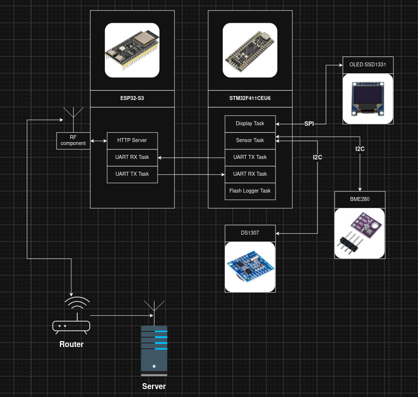

# Embedded Weather Logger

A two-board embedded weather station: an STM32 microcontroller reads sensors, drives a local OLED display, and logs readings to flash, while an ESP32 polls the STM32 over UART and exposes the latest reading over Wi-Fi as a JSON HTTP API.

```
┌─────────────────────────────┐   UART    ┌──────────────────────────────┐
│  stm32-weather-logger       │ ───────── │  esp32-weather-data-provider │
│  (STM32F411CEU6)            │           │  (ESP32-S3)                  │
│                             │           │                              │
│  BME280 (temp/humidity/     │           │  Wi-Fi station               │
│  pressure) + DS1307 RTC     │           │  HTTP server                 │
│  SSD1331 OLED display       │           │  GET /api/v1/sensors         │
│  Internal flash data logging│           │                              │
└─────────────────────────────┘           └──────────────────────────────┘
```

## Projects

- **`stm32-weather-logger/`** — STM32CubeIDE project for an STM32F411CEU6. Reads a BME280 sensor (SPI) and a DS1307 RTC (I2C), renders readings to an SSD1331 OLED (SPI), buffers readings and periodically persists them to internal flash, and exposes a line-based command console over USART1.
- **`esp32-weather-data-provider/`** — ESP-IDF project for an ESP32-S3. Periodically requests a sensor snapshot from the STM32 over UART, caches it, connects to Wi-Fi, and serves the cached snapshot over HTTP. It also exposes its own separate UART command console.

The two firmware projects are built and flashed independently — there is no shared build system, and no shared code between them (the wire-format struct is duplicated in each project's `common.h`).

## Hardware

- **MCU**: STM32F411CEU6 (Cortex-M4, "Black Pill"-style board)
  - BME280 — temperature / humidity / pressure sensor, SPI1 (PA5/PA6/PA7)
  - DS1307 — real-time clock, I2C1
  - SSD1331 — 96x64 color OLED display, SPI1
  - USART1 (PA9 TX / PA10 RX, DMA RX) — link to the ESP32 and/or a serial console
- **Wi-Fi/HTTP module**: ESP32-S3
  - UART1 and UART2 — configurable pins/baud via `idf.py menuconfig` (defaults: UART1 GPIO37/38, UART2 GPIO47/48, 115200 baud)

## Data flow

1. STM32 reads BME280 + DS1307 and updates the OLED continuously.
2. When logging is enabled (`log on` command), readings are buffered and periodically flushed to internal flash.
3. The ESP32 sends `status` to the STM32 over UART on a timer (default every 60s, configurable) and gets back a JSON sensor snapshot, which it caches.
4. Any client on the Wi-Fi network can `GET /api/v1/sensors` on the ESP32 to retrieve the latest cached snapshot as JSON.

## Architecture



### STM32 UART command console

Send `\n`-terminated ASCII commands over USART1:

| Command | Effect |
|---|---|
| `status` | Reply with the current sensor snapshot as JSON |
| `log on` / `log off` | Enable/disable buffering readings for flash logging |
| `flush` | Force-write buffered readings to internal flash |
| `set-date YYYY-MM-DD` | Set the RTC date |
| `set-time HH:MM:SS` | Set the RTC time |

### ESP32 UART command console

Send `\n`-terminated ASCII commands over UART1:

| Command | Effect |
|---|---|
| `get data` | Reply with the last cached sensor snapshot as JSON |

## Building & flashing

### ESP32 (`esp32-weather-data-provider/`)

Requires the [ESP-IDF](https://docs.espressif.com/projects/esp-idf/en/latest/get-started/index.html) toolchain sourced in your shell:

```bash
cd esp32-weather-data-provider
idf.py menuconfig   # set Wi-Fi SSID/password under "App Configuration"
idf.py build
idf.py -p <PORT> flash monitor
```

### STM32 (`stm32-weather-logger/`)

Open the project in STM32CubeIDE (build/flash/debug from there), or build headlessly with the pre-generated makefile:

```bash
cd stm32-weather-logger/Debug
make -j
```

Flash the resulting `.elf` with STM32CubeProgrammer or from STM32CubeIDE.
